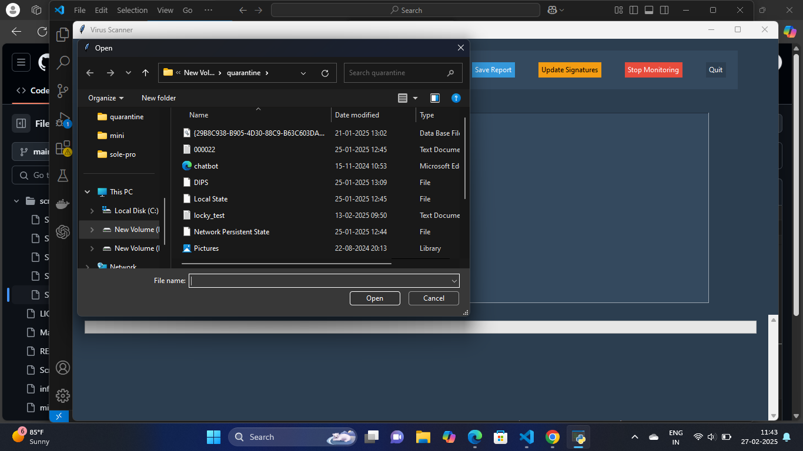
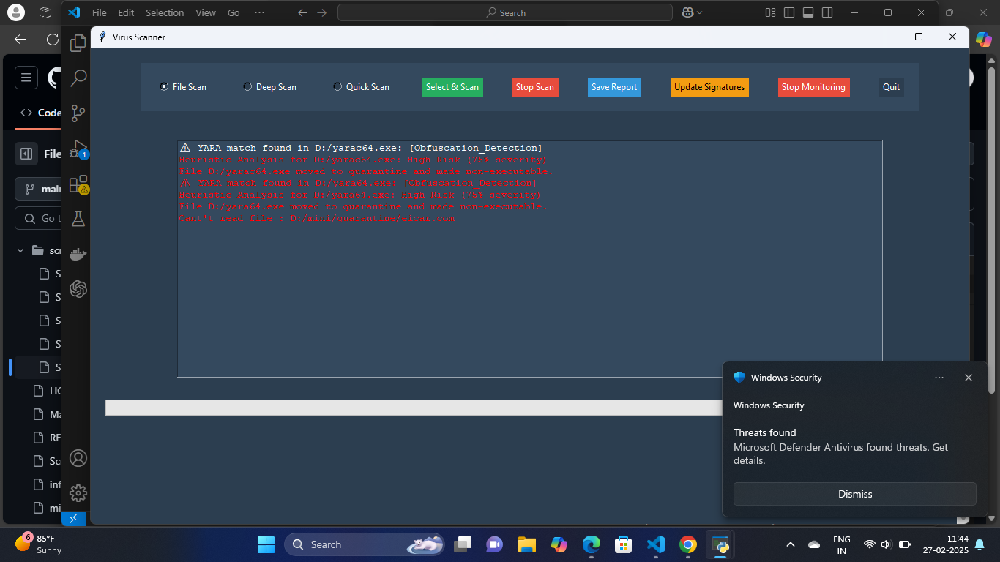
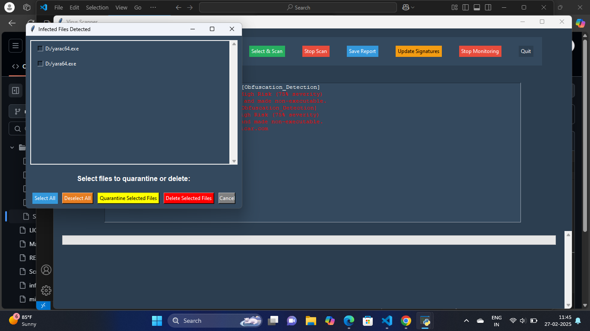

# Antivirus Scanner Application

An antivirus scanner application built using Python and Tkinter. This tool enables file and directory scanning, malware detection using hash signatures and YARA rules, and provides features like heuristic analysis, real-time scanning, and file quarantine.

## Features

- **File and Directory Scanning**: Scan individual files or directories for malware.
- **Hash-Based Detection**: Identify malware using known hash signatures.
- **YARA Rules Integration**: Detect malware based on custom YARA rules.
- **Heuristic Analysis**: Identify suspicious patterns in files.
- **Quarantine and Deletion**: Move infected files to a quarantine directory or delete them.
- **Real-Time Scanning**: Monitor directories for file changes in real time.
- **GUI Interface**: User-friendly interface built with Tkinter.
- **Progress Tracking**: Real-time progress bar for scan operations.

## Requirements

- Python 3.6+
- Required Python modules:
  - `tkinter`
  - `hashlib`
  - `yara-python`
  - `watchdog`
  - `concurrent.futures`

## Usage
1.Run the application:   
    python mini_project.py
2.Use the GUI to:

 - Select and scan files or directories.
 - View scan results.
 - Quarantine or delete infected files.
 - Start real-time scanning for directory changes.
 - Update malware signatures.

## File Structure

`mini_project.py`: Main application script.
`malware_hashes.txt`: File containing known malware hashes (update as needed).
`rules.yar`: YARA rules for malware detection.

## Application Screenshots

### Main Interface

### File Scanning Feature

 

